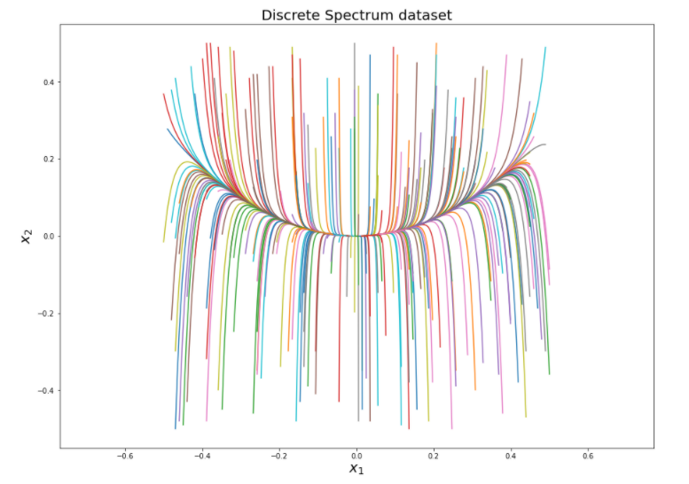

Consider a simple nonlinear discrete spectrum system, described as follows: 

$$\dot{x_{1}} = \mu x_{1}$$

$$\dot{x_{2}} = \lambda (x_{2} - x_{1}^{2})$$

Given the input data we measure the dynamic mode decomposition accuracy by equation (6) and (7). As a result, $L_{2} =  3.27 × 10^{-4}$ and $L_{3} = 5.055 × 10^{-5}$, whereas in the latent space dataset $Y$, $L_{2} =  3.006 × 10^{-4}$ and $L_{3} = 2.703 × 10^{-4}$. While the DMD loss decreased, the predictability loss did not improve. There is more room for improvement by adjusting the network's hyper-parameters. 
