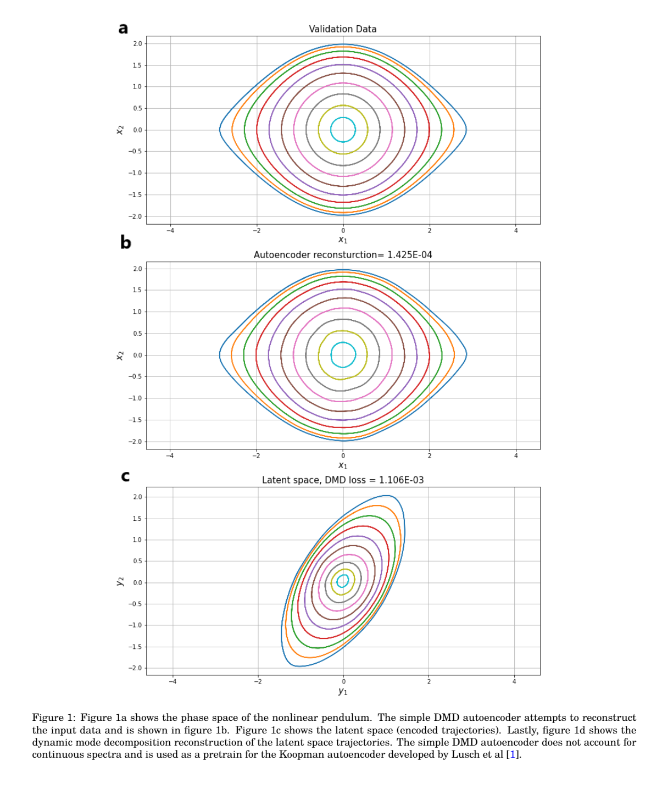
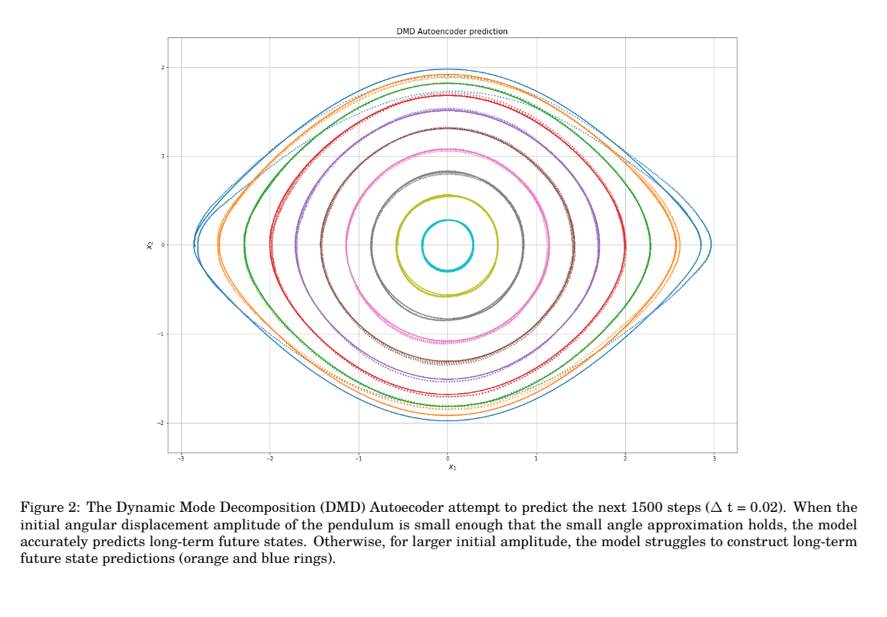
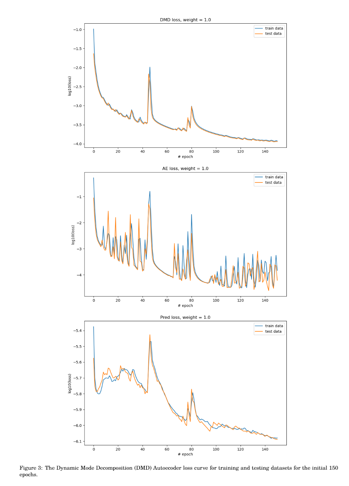

Consider the simple pendulum which is a nonlinear continuous spectra systems, described as follow: 
 
$$\dot{x_{1}} = x_{2}$$
    
$$\dot{x_{2}} = -\sin(x_{1})$$

with the potential function $\frac{1}{2}x_{2}^{2} - \cos(x_{1})$.

Given the input data we measure the dynamic mode decomposition accuracy by equation (6) and (7). As a result, $L_{2} = 1.574 × 10^{-1}$ and $L_{3} = 2.658 × 10^{-2}$, whereas in the latent space dataset $Y$, $L_{2} =  1.737 × 10^{-3}$ and $L_{3} = 9.51 × 10^{-4}$. These results show that the encoder network finds a mapping which the nonlinear dynamics become approximately linear. 

The pendulum system training loss curves
