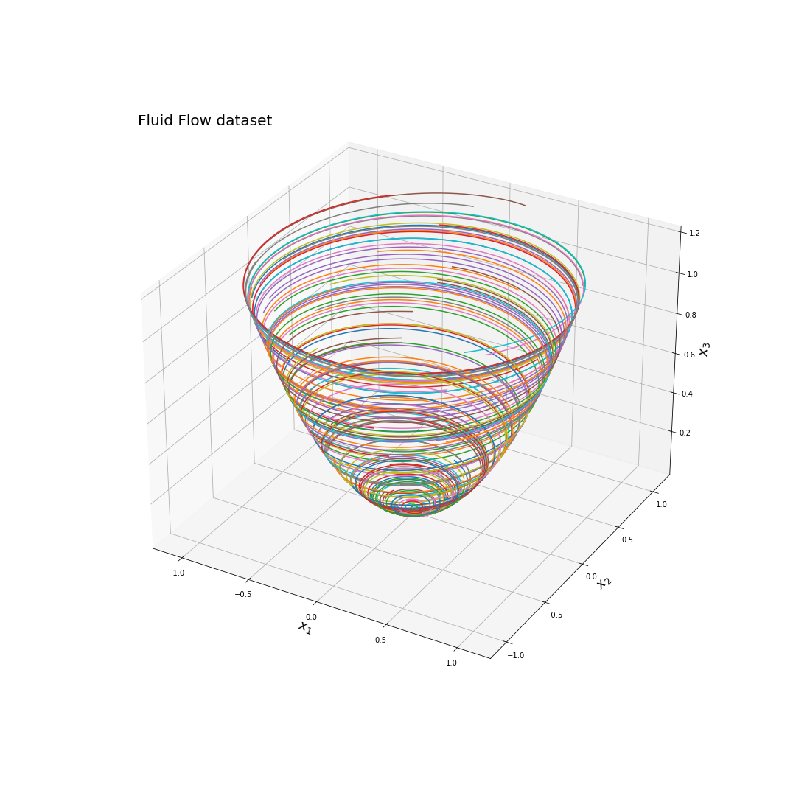

# Fluid Flow Dataset

Consider the nonlinear mean-field model of fluid flow past a circular cylinder at Reynolds number 100, described by empirical Galerkin model:

$$ \dot{x_{1}} = \mu x_{1} - \omega x_{2} + A x_{1} x_{3} $$ 

$$ \dot{x_{2}} = \omega x_{1}  + \mu x_{2} + A x_{2} x_{3} $$ 

$$ \dot{x_{3}} =  -\lambda (x_{3} - x_{1}^{2} - x_{2}^{2})$$

Where $\mu=0.1$, $\omega=1$, $A=-0.1$, $\lambda = 10$. 

The slow manifold toward the limit cycle:
