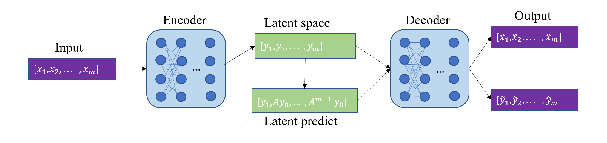

# DMD Autoencoder

The figure above illustrates the simple DMD autoencoder architecture. The input time sequential dataset $X$ is passed to the encoder which is a nonlinear mapping $g$. The encoder output is called the latent space $y_{k} = g(x_{k})$. The latent space $Y$ is predicted by the Dynamic Mode Decomposition, $\tilde y_{k+1}$ = $A^{k}y_{0}$. Both the latent space $Y$ and predicted latent space $\tilde{Y}$ are passed to the decoder $g^{-1}$. Lastly, the decoder outputs $g^{-1}(Y)$ and $g^{-1}(\tilde{Y})$.

Important subroutines: 

- `dmd_machine/autoencoder_network.py` - The Autoencoder network is a Keras sequential model. 

- `dmd_machine/dmd_ae_machine.py` - The DMD Autoencoder, computes the predicted latent $\tilde{Y}$ by the dynamic mode decomposition algorithm. 
